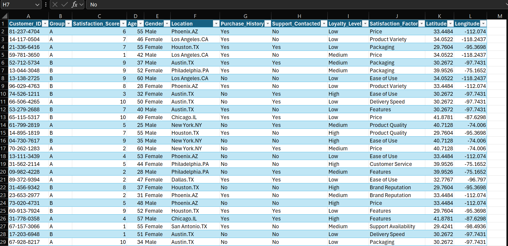
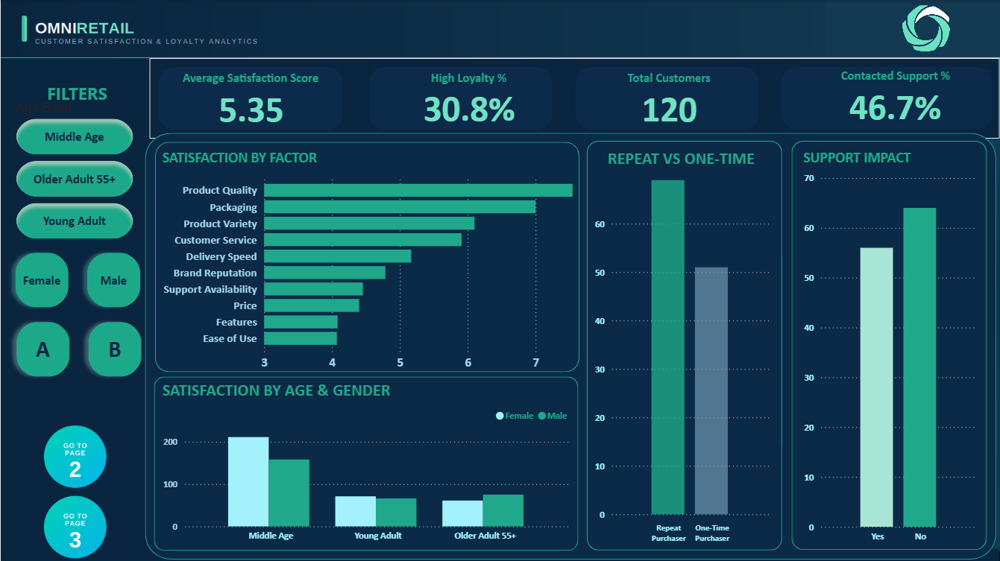
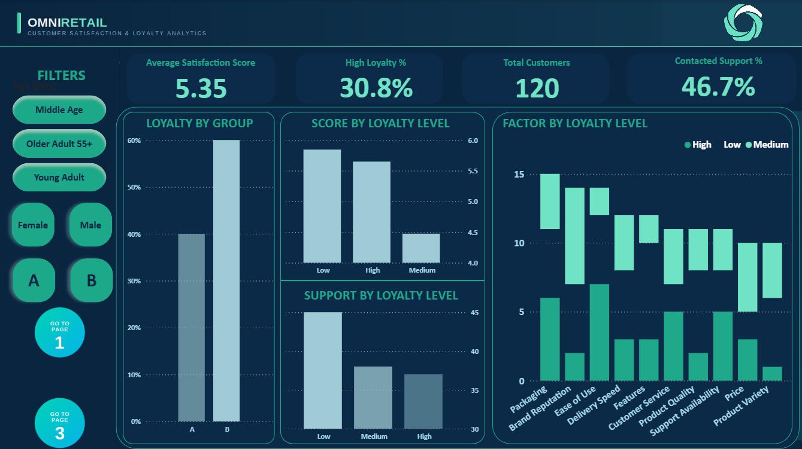
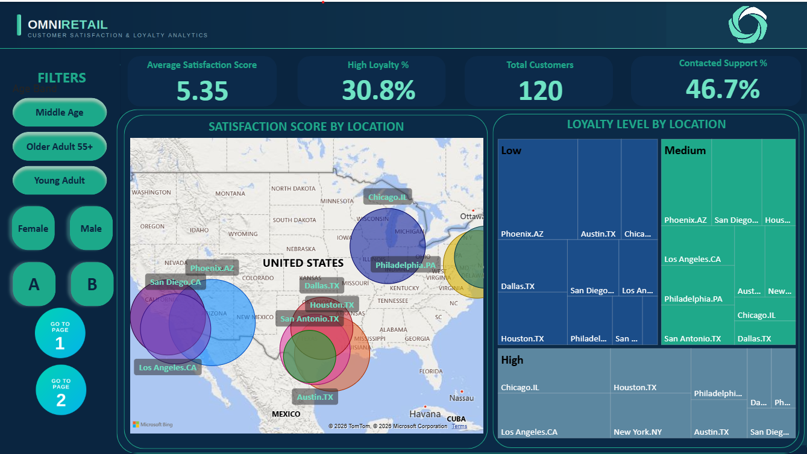

# Omni Retail Customer Satisfaction Analysis

## Project Overview

The **Omni Retail Customer Satisfaction Analysis** is a Power BI project focused on understanding customer satisfaction, loyalty, purchasing behavior, support interactions, demographics, and geographic patterns.

The project transforms customer-level data into an interactive business intelligence report designed to identify satisfaction and loyalty patterns across different customer segments.

**Tools:** Power BI | DAX | Data Modeling | Data Visualization | Data Storytelling | Interactive Slicers | KPI Cards

---

## Business Problem & Project Objectives

| **Business Problem**                                                               | **Project Objectives**                                                    |
| ---------------------------------------------------------------------------------- | ------------------------------------------------------------------------- |
| Understanding the factors influencing customer satisfaction and loyalty.           | Analyze satisfaction scores and satisfaction factors.                     |
| Identifying differences in satisfaction across customer segments.                  | Compare satisfaction by age, gender, and customer group.                  |
| Understanding the relationship between purchasing behavior and satisfaction.       | Compare satisfaction across purchase-history groups.                      |
| Examining the relationship between satisfaction and customer loyalty.              | Analyze loyalty levels and satisfaction across loyalty categories.        |
| Understanding how customer support interactions relate to the customer experience. | Analyze support-contact patterns alongside satisfaction and loyalty.      |
| Identifying geographic differences in customer experience.                         | Analyze satisfaction and loyalty across locations.                        |
| Providing an interactive way to explore customer patterns.                         | Build a multi-page Power BI report using KPIs, charts, maps, and slicers. |

---

## Dataset & Key Fields

The analysis uses a customer-level dataset stored in **`Table1`**.

| Field                  | Purpose                               |
| ---------------------- | ------------------------------------- |
| `Satisfaction_Score`   | Measures customer satisfaction        |
| `Satisfaction_Factor`  | Used to compare satisfaction factors  |
| `Loyalty_Level`        | Segments customers by loyalty         |
| `Purchase_History`     | Analyzes purchasing behavior          |
| `Support_Contacted`    | Analyzes customer support interaction |
| `Age Band`             | Groups customers by age               |
| `Gender`               | Demographic segmentation              |
| `Group`                | Customer-group analysis               |
| `Location`             | Geographic analysis                   |
| `Latitude / Longitude` | Map visualization                     |

---

## DAX & KPI Development

Key DAX measures were created to support the main performance indicators:

* **Average Satisfaction Score** - measures overall customer satisfaction.
* **Total Customers** - calculates the size of the customer base.
* **High Loyalty %** - measures the proportion of highly loyal customers.
* **Contacted Support %** - measures the percentage of customers who contacted support.

These measures are presented through KPI cards and respond dynamically to the report filters.

---
### Filters

**Age Band | Gender | Group**

These slicers allow specific customer segments to be explored dynamically.

#### The analytical flow moves from **overall satisfaction → loyalty → geographic analysis**, creating a structured customer-experience story.

## Dashboard 1 - Satisfaction Analysis

The first page focuses on overall customer satisfaction and its key drivers.

### Key Analysis

* **KPI Cards:** Average Satisfaction Score, High Loyalty %, Total Customers, and Contacted Support %.
* **Satisfaction by Factor:** Compares satisfaction across different satisfaction factors.
* **Satisfaction by Age & Gender:** Examines demographic differences.
* **Purchase History:** Compares satisfaction across purchasing behaviors.
* **Support Impact:** Examines satisfaction in relation to support interaction.

---

## Dashboard 2 — Customer Loyalty Analysis

The second page focuses on customer loyalty and its relationship with satisfaction.

### Key Analysis

* **Loyalty by Group:** Compares loyalty distribution across customer groups.
* **Score by Loyalty Level:** Compares satisfaction across low, medium, and high loyalty.
* **Satisfaction Factor by Loyalty:** Examines satisfaction factors across loyalty categories.
* **Support by Loyalty Level:** Analyzes support interaction across loyalty groups.

## Dashboard 3 — Geographic Analysis

The third page explores geographic patterns in customer satisfaction and loyalty.

### Key Analysis

* **Loyalty by Location:** Uses a treemap to visualize loyalty distribution by location.
* **Satisfaction by Location:** Uses geographic coordinates to visualize satisfaction across locations.
* **Customer Segmentation:** Demographic filters allow geographic patterns to be explored by specific customer groups.

---

## Business Applications

The analysis can support:

* **Customer Experience:** Identify satisfaction patterns and factors requiring further attention.
* **Customer Retention:** Understand characteristics associated with different loyalty levels.
* **Customer Support:** Examine support interactions alongside satisfaction and loyalty.
* **Customer Segmentation:** Compare demographic, behavioral, and loyalty groups.
* **Geographic Strategy:** Identify differences in satisfaction and loyalty across locations.

---

## Skills Demonstrated

### Data Analysis
* Customer behavior analysis
* Customer segmentation
* Pattern and relationship analysis
* Business-question development

### Power BI & DAX
* Interactive dashboard development
* KPI creation
* DAX measures
* Slicers and cross-filtering
* Geographic visualization
* Multi-page report design

### Data Storytelling
Presented customer information through a logical flow of **KPIs, satisfaction, loyalty, and geographic analysis** to make the data easier to explore and interpret.

---

## 🎓 Project Outcome

This project demonstrates how customer level data can be transformed into an interactive business intelligence solution.

The analysis combines **satisfaction, loyalty, demographics, purchase behavior, support interactions, and geographic information** to provide a broader view of the customer experience.

It also demonstrates practical experience with **Power BI, DAX, data visualization, customer segmentation, analytical thinking, and data storytelling**.

---

## 👤 About Me

**Opeyemi Soneye**

Data Analyst | Power BI | Excel | SQL | Data Visualization
